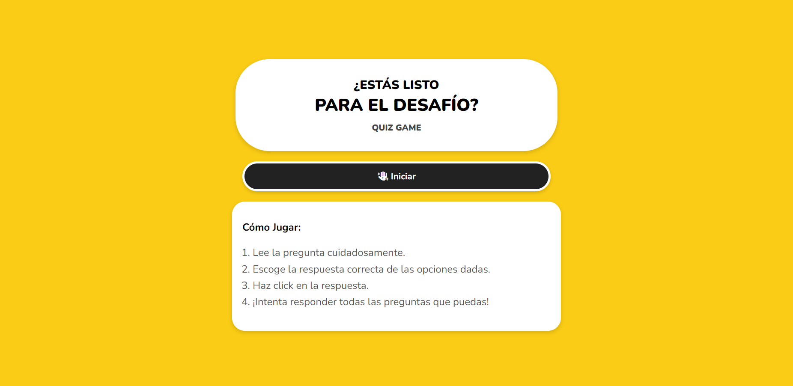
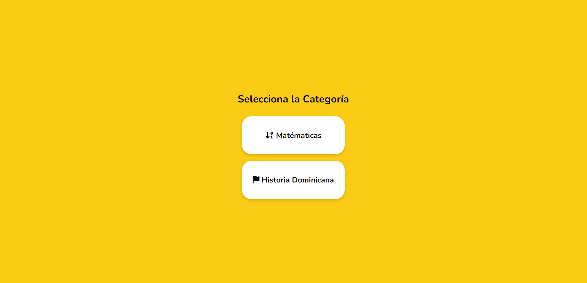
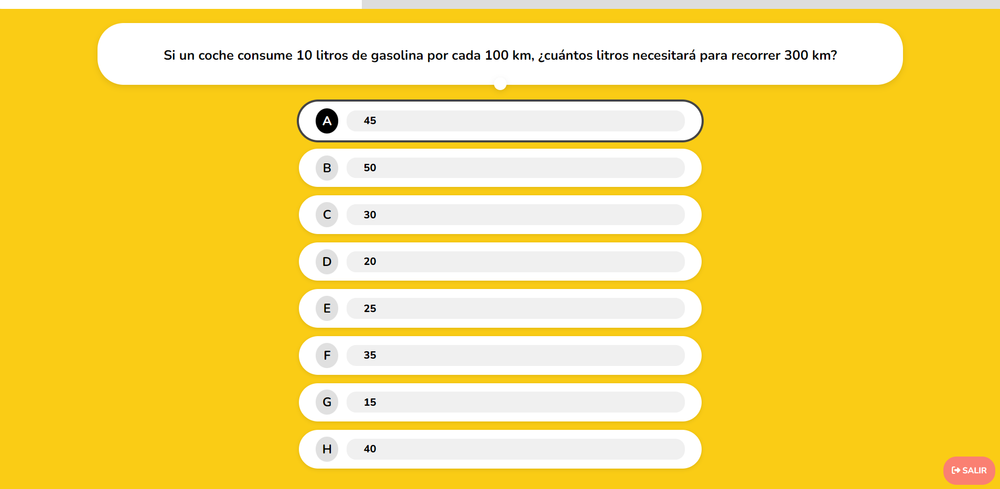

 # QUIZ GAME - JUEGO DE PREGUNTAS Y RESPUESTAS

 ## Descripción General
 **Quiz Game** es una aplicación web interactiva desarrollada con **Angular 18.0.4** que permite poner a prueba tus conocimientos en dos categorías: **Matemáticas** e **Historia Dominicana**. Está pensada para ofrecer una experiencia de juego dinámica y entretenida, donde las preguntas y las opciones de respuesta se seleccionan y ordenan de forma aleatoria, garantizando que cada partida sea diferente a la anterior.

 La aplicación está alojada en **Vercel**, lo que facilita su acceso desde cualquier navegador moderno sin necesidad de instalaciones adicionales.

 **Demo en vivo:** [https://number-the-game.vercel.app/](https://number-the-game.vercel.app/)  

 

 ## Características del Juego

 - **Categorías disponibles:**
   - **Matemáticas**: Operaciones básicas, cálculos simples, etc.
   - **Historia Dominicana**: Preguntas sobre hechos históricos, personajes y acontecimientos clave del país.

 - **Modos de juego:**  
   Selecciona la duración de la partida con:
   - 5 preguntas
   - 10 preguntas
   - 15 preguntas

 - **Dificultad y tiempo:**  
   Las preguntas cuentan con un nivel de dificultad (Fácil, Intermedio, etc.) y un tiempo límite establecido. En pantalla se muestra una barra de carga visual para indicar el tiempo restante. Si el tiempo se acaba, la pregunta se da por no contestada (time out).

 - **Aleatoriedad:**  
   Tanto las preguntas como las respuestas se mezclan aleatoriamente, por lo que nunca sabrás en qué orden aparecerán.

 - **Pantallas del juego:**
   - **Pantalla de inicio** con música de fondo para ambientar la experiencia.
   - **Pantalla de selección de categoría y modo de juego** para que elijas tu reto.
   - **Pantalla de carga** antes de iniciar las preguntas.
   - **Pantalla de pista (hint)** antes de mostrar la pregunta, para darte una pequeña ayuda.
   - **Pantalla de pregunta** con múltiples opciones, solo una es correcta.
   - **Pantallas de retroalimentación:**
     - Pregunta respondida correctamente.
     - Pregunta respondida incorrectamente.
     - Pantalla de "time out" si se agota el tiempo.
   - **Pantalla de resumen final** que muestra tu desempeño al final del juego.

 ## Tecnologías Utilizadas

 - **Angular 18.0.4**: Framework principal para el desarrollo de la SPA (Single-Page Application).
 - **TypeScript**: Lenguaje de programación utilizado para el código fuente.
 - **CSS**: Estilos personalizados para la interfaz de usuario.
 - **FontAwesome 6.6.0 (CDN)**: Íconos utilizados en la interfaz para mejorar la experiencia visual.
 - **Vercel**: Plataforma de despliegue continuo y hosting, permitiendo acceder a la aplicación en línea.

 ## Requisitos

 - **Node.js 20** o superior (requerido para correr el proyecto localmente).
 - **NPM (Node Package Manager)** para instalar dependencias.

 ## Cómo Clonar y Ejecutar Localmente

 1. **Clonar el repositorio:**
    ```bash
    git clone https://github.com/Jofreylin/NUMBER_THE_GAME.git
    ```

 2. **Ingresar al directorio del proyecto:**
    ```bash
    cd NUMBER_THE_GAME
    ```

 3. **Instalar las dependencias:**
    ```bash
    npm install
    ```

 4. **Iniciar el servidor de desarrollo:**
    ```bash
    ng serve
    ```
    
    Una vez iniciado, podrás acceder a la aplicación en:
    ```
    http://localhost:4200
    ```

 ## Imágenes de Referencia

 - **Pantalla de Inicio:**
   

 - **Selección de Categoría:**
   

 - **Pantalla de Pregunta con Opciones:**
   


 ## Notas Adicionales

 - El pool de preguntas (MathQuestionPool, HistoryQuestionPool) está definido en archivos TypeScript, incluyendo atributos como `question`, `hint`, `difficulty`, `time`, y un array `answers` con `value` e `isCorrect` para identificar la respuesta correcta.
 - Las respuestas se barajan aleatoriamente antes de mostrarse, y las preguntas también se seleccionan aleatoriamente dentro del pool.
 - La barra de tiempo dinámica depende de la dificultad de la pregunta, para crear tensión y evitar que el jugador se tome demasiado tiempo.

 ## Licencia

 Este proyecto se publica bajo la licencia **MIT**.

 ---

 **Autor:** Jofreylin P.
